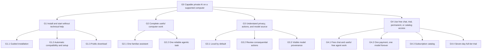
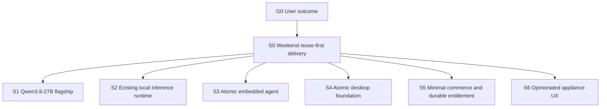

# YoreBot MVP Goal Tree

> Authority: canonical product and weekend-MVP alignment document
> Owner/decider: Enrique Mendez
> Last aligned: 2026-08-28
> Tracking: no issue yet; this directory is not a Git repository

## Reading rules

- The tree defines why and what. Issues will define implementation work.
- `committed` means chosen, not built or verified.
- Only Enrique can authorize goal, strategy, constraint, or decision changes.
- Repository, test, deployed, and real-user proof remain distinct.

## Root

### G0 — A nontechnical person can obtain capable private AI help on a supported computer

- Type: `goal`
- State: `committed`
- Success: By the end of the weekend, a first-time user can publicly download the app, install it on declared supported hardware, start a useful chat or agentic task, understand and approve consequential actions, and reach a useful result without a terminal, developer help, or choices about models, runtimes, providers, or hardware tuning.
- Non-goals: training a foundation model; inventing a new inference engine; enterprise/government procurement; supporting every computer; hiding model provenance.

## Outcome tree



### G1 — Install and start without technical help

- Type: `goal`
- State: `committed`
- Success: A first-time user goes from download to first response without a terminal, model-format choice, or manual configuration.
- Evidence: none; no implementation exists.

| ID | Type | State | Outcome | Success signal | Evidence |
|---|---|---|---|---|---|
| G1.1 | capability | committed | Guided desktop installation | Clean-machine install and launch succeeds using ordinary installer interactions | none |
| G1.2 | capability | committed | Automatic compatibility and setup | The app rejects unsupported hardware before purchase/download, then automatically selects and installs exactly one pinned, verified configuration | none |
| G1.3 | capability | committed | Public download | A new user can obtain the current installer from a stable public page | none |

### G2 — Complete useful computer work

- Type: `goal`
- State: `committed`
- Success: A nontechnical user completes a representative multi-step task, not merely a benchmark prompt.
- Evidence: none; Qwen's model card is external capability evidence, not product proof.

| ID | Type | State | Outcome | Success signal | Evidence |
|---|---|---|---|---|---|
| G2.1 | capability | committed | One familiar assistant | The user can start, stop, resume, and understand work through one assistant without selecting or learning models, providers, runtimes, or tools | none |
| G2.2 | capability | committed | Reliable agentic task | On a controlled Downloads-folder fixture, the assistant proposes an organization plan, previews every change, waits for approval, applies exactly the approved moves, summarizes the result, and successfully undoes one move | task selected by Enrique; not run |

### G3 — Understand privacy, actions, and model source

- Type: `goal`
- State: `committed`
- Success: Before trusting the app, the user can tell what remains local, what will change, and which upstream model is running.
- Evidence: none.

| ID | Type | State | Outcome | Success signal | Evidence |
|---|---|---|---|---|---|
| G3.1 | capability | committed | Local by default | The tested task sends no prompt, file, or inference data off-device | none |
| G3.2 | capability | committed | Review consequential actions | Filesystem, account, purchase, message, and destructive actions show a plain-language preview and require approval | none |
| G3.3 | capability | committed | Visible provenance | Model details and checkout disclose canonical model, developer, license, version, and checksum | none |

### G4 — Use free chat, trial, permanent, or catalog access

- Type: `goal`
- State: `committed`
- Success: Chatting with any free or owned local model is not usage-metered; free agent mode includes 2,000,000 model tokens per day; a new user can try the complete subscription tier free for seven days; and every paid entitlement matches its plain-language promise.
- Evidence: none.

| ID | Type | State | Outcome | Success signal | Evidence |
|---|---|---|---|---|---|
| G4.1 | capability | committed | Free chat and useful free agent work | Chat with any free or owned local model has no message/token paywall; free agent mode receives 2,000,000 model tokens per day and ordinary chat never consumes that allowance | human decision, 2026-08-28 |
| G4.2 | capability | committed | One payment permanently unlocks one model pack | A `$200` purchase permits that model pack to keep running with no further charge; successor models are separate | human decision, 2026-08-28 |
| G4.3 | capability | committed | Subscription unlocks the supported catalog | `$20/month` or `$200/year` grants current and future supported model packs while subscribed | human decision, 2026-08-28 |
| G4.4 | capability | committed | Seven-day full-tier trial | Hosted checkout grants a new user the complete subscription tier free for seven days, shows the first-charge date before activation, permits cancellation, and falls back to the free tier when canceled | human decision, 2026-08-28 |

## Delivery strategy tree



| ID | Type | State | Strategy or constraint | Success signal |
|---|---|---|---|---|
| S0 | strategy | committed | Take the easiest buildable path: fork, configure, simplify, and reuse maintained open-source code; accept upstream defaults; write only irreducible product-specific seams; do no comparative benchmarking or optional optimization in the MVP | Every shipped subsystem comes from Atomic or a named hosted service unless a smallest-possible missing seam directly serves a success signal |
| S1 | strategy | committed | Launch with `Qwen/Qwen3.8-27B` as the flagship where Atomic says it fits and use Atomic's existing supported model choices for other hardware; keep canonical upstream model names; DeepSeek-V4/FreeToken is not a launch dependency | Each declared machine loads the configuration selected by Atomic's existing fit logic and passes the product smoke task |
| S2 | strategy | committed | Use and pin Atomic v2.0.0's existing default `llama.cpp`/GGUF runtime and quantization path; do not compare runtimes, quants, or throughput | The pinned default starts, produces a response, and completes G2.2 on declared hardware |
| S3 | strategy | committed | Use only Atomic Chat v2.0.0's embedded local agent; harden every mutation to preview and approve once; do not integrate another harness for the MVP | Atomic's agent completes G2.2; a deny-with-no-side-effect test and exact command/diff previews prove G3.2 |
| S4 | strategy | committed | Fork and radically simplify only Atomic Chat v2.0.0 (`e9810b0c99f3d14f4dfb5d2e28b8c1fdbd044233`) as the desktop foundation | Installer, chat, automatic setup/download, hardened approval, persistence, and updates work end to end with technical surfaces removed |
| S5 | strategy | committed | Reuse hosted checkout for a seven-day full-tier trial, subscription, and permanent model purchases; keep permanent purchases separate from catalog access | Entitlement tests cover trial start/cancel/expiry, purchase, subscription cancellation, offline use, and future-model exclusion |
| S6 | strategy | committed | Present one assistant and make technical choices automatically; build an appliance for ordinary people, not an AI workbench | An uncoached nontechnical user reaches a useful result without encountering or choosing a model, provider, runtime, quantization, tool protocol, or hardware parameter |
| C1 | constraint | committed | Usable MVP launches by the end of the weekend | G0's clean-machine acceptance flow passes before launch |
| C2 | constraint | committed | Windows is the guaranteed first target; macOS is not allowed to delay Windows | Windows package passes; macOS status is explicit |
| C3 | constraint | committed | Inference and user data remain local by default | Network audit finds no inference-data egress |
| C4 | constraint | committed | Upstream origin and licenses cannot be disguised | Provenance is adjacent in model details and purchase disclosure; notices ship |
| C5 | constraint | committed | Marketing cannot claim unverified privacy, performance, compatibility, or origin | Every launch claim maps to current test evidence |
| C6 | constraint | committed | No lifetime catalog promise | Permanent entitlement is scoped to the purchased model pack |
| C7 | constraint | committed | “Launch” means a signed public Windows download, real payment/restore path, and uncoached nontechnical-user proof—not a local build | All four forms of evidence exist before the launch claim |
| C8 | constraint | committed | `localLM` is an internal development name; the MVP customer-facing brand is `YoreBot` | Public surfaces use `YoreBot`; a later rename remains allowed without changing product scope |
| C9 | constraint | committed | The consumer product exposes no model hub, model picker, provider list, runtime controls, quantization, context, thread, VRAM, MCP, or local-API configuration; there is no advanced mode in the MVP | Primary navigation contains only user outcomes; unavoidable technical details appear only in automatic diagnostics or `About this AI` |
| C10 | constraint | committed | Do not reengineer, benchmark, rename, or optimize solved infrastructure for the MVP; deleting or hiding surplus capability is preferred to rebuilding inference, model management, chat, agent execution, updates, packaging, persistence, or model branding | Original code is limited to the smallest missing behavior that directly supports a success signal; no alternate foundation, harness, runtime comparison, quant comparison, or model alias ships |
| C11 | constraint | committed | Never ask the user to choose a model. Use Atomic's existing hardware-fit logic plus a pinned manifest to select one eligible configuration; if it cannot load and pass the smoke task, declare the computer unsupported | Each declared hardware profile deterministically maps to one pinned model/runtime/quant; no picker exists; `About this AI` uses the canonical upstream model name and provenance |
| C12 | constraint | committed | Reach both ordinary Windows laptops and high-end PCs; they may run different automatically selected models and configurations | At least one ordinary-laptop profile and one high-end-PC profile each pass the same clean-machine product smoke; no comparative performance matrix is required |

## Open decisions

| ID | Decision | Why it matters | Decider | Evidence needed | Deadline/default |
|---|---|---|---|---|---|
| D6 | How a permanent model-pack buyer proves ownership after reinstalling, changing computers, going offline, or if our company/server disappears | “Forever” means the downloaded model must keep working without recurring permission from us, while restoration must not make licenses meaningless | Enrique after a concrete design | Plain-language comparison of a signed portable license, account restore, device recovery, and company-shutdown behavior | Before checkout; continued local use without renewal is mandatory |
| D8 | Windows signing path | Unsigned installers create warnings that break the nontechnical-user outcome | Implementation lead; Enrique only for identity/certificate purchase | Certificate availability, cost, acquisition time, and clean-machine SmartScreen behavior | Investigate immediately; no unsigned public launch |

### Resolved decisions

| ID | Type | State | Resolution |
|---|---|---|---|
| D1 | decision | committed | Do not choose an arbitrary VRAM minimum. Support every Windows hardware profile that passes the common task, responsiveness, memory, thermal, stability, and privacy gates; fail closed for profiles that do not. |
| D2 | decision | committed | Use Atomic v2.0.0's existing default `llama.cpp`/GGUF runtime and quantization path, pin its exact artifacts, and change it only if the pass/fail product smoke fails. Do not benchmark alternatives. |
| D4 | decision | committed | Chat with a free or owned model is unmetered. The free agentic tier includes 2,000,000 model tokens per user per day; only agent-mode model usage counts against it. |
| D5 | decision | committed | Keep canonical upstream model names in the MVP. Model aliases and model rebranding are deferred; provenance remains visible. |
| D3 | decision | committed | Atomic's embedded agent is the only MVP harness. OMP, Pi, Hermes, and custom harness work are out of scope. |
| D9 | decision | committed | The controlled Downloads-folder task in G2.2 is a pass/fail product smoke for Atomic's agent, not a harness comparison or performance benchmark. |
| D10 | decision | committed | Target both ordinary Windows laptops and high-end PCs. Automatically give each supported profile its best verified local model/configuration; do not promise support for an untested profile. |
| D11 | decision | committed | Launch the subscription immediately even if only one supported model is available; disclose the exact launch catalog and that new supported models are added while subscribed. |
| D13 | decision | committed | Atomic Chat v2.0.0 at `e9810b0c99f3d14f4dfb5d2e28b8c1fdbd044233` is the only MVP foundation. Jan and other foundations are out of scope. |
| D12 | decision | committed | Use `YoreBot` as the MVP app name. Treat the name as reversible after launch; do not let further naming work delay the MVP. |

### Retired decisions

| ID | State | Resolution |
|---|---|---|
| D7 | retired | Weekend scope is Windows-first. macOS remains a post-MVP target and cannot delay Windows. |

## Evidence ledger

| Node | Level | Evidence | Last checked |
|---|---|---|---|
| S1 | none | [Official Qwen3.8-27B model card](https://huggingface.co/Qwen/Qwen3.8-27B) reports 27B dense multimodal weights, 262K native context, tool use, and Apache-2.0; not locally verified | 2026-08-28 |
| D1, D2, C11, C12 | human decision; no test proof | Atomic's existing fit/default path will be pinned without comparative benchmarking; no ordinary/high-end pass/fail smoke exists yet | 2026-08-28 |
| S2 | source-selected; no test proof | Atomic's existing default `llama.cpp`/GGUF path is selected; exact artifacts have not been pinned or smoke-tested | 2026-08-28 |
| S3, S4, D3, D13 | source-audited | [MVP Codebase Selection](CODEBASE_SELECTION.md) records Atomic v2.0.0 as the sole foundation and harness plus blocking approval, integrity, telemetry, and signing gaps; no Windows build or product task has passed | 2026-08-28 |
| C11 | human decision | Enrique required automatic choice with no model picker and no comparative benchmarking; Atomic's existing fit logic has not been product-smoked | 2026-08-28 |
| G1.1 | none | Empty project directory; no installer | 2026-08-28 |
| G2.2, D9 | human decision; no test proof | Downloads-folder organization/approval/undo task selected; it has not been run in any harness | 2026-08-28 |
| G4.1, D4 | human decision; no test proof | Chat is unmetered for free or owned models; free agent mode receives 2,000,000 model tokens per user per day; accounting and reset behavior are not implemented or tested | 2026-08-28 |
| G4.4, S5 | human decision; no test proof | Seven-day access to the complete subscription tier is committed; hosted checkout, cancellation, expiry, and fallback are not implemented or tested | 2026-08-28 |
| C8, D12 | human decision | Enrique selected `YoreBot` for the MVP and explicitly allowed a later rename | 2026-08-28 |
| D8, C1, C7 | external documentation; no account proof | Microsoft Store MSIX signing avoids SmartScreen warnings but certification can take three business days. Azure Artifact Signing starts at `$9.99/month`, requires identity validation that can take 1–20 business days, and does not guarantee immediate SmartScreen reputation. No existing signing identity or Store submission is verified, so a signed weekend launch is at risk | 2026-08-28 |
| G3.1 | none | No network audit | 2026-08-28 |
| G4.2 | none | Pricing decision exists; no checkout or entitlement implementation | 2026-08-28 |

## Weekend acceptance gate

Launch requires one uncoached nontechnical user on a clean supported Windows machine to demonstrate, without a terminal:

1. Obtain the signed installer from the public download page, install it, and open the app.
2. Pass the automatic hardware check before downloading or paying without choosing technical settings.
3. Let Atomic's existing fit logic select, download, and verify the pinned entitled configuration without offering a model choice or running comparative benchmarks.
4. Chat freely, then complete G2.2's controlled Downloads-folder organization, approval, summary, and undo task within the free-agent allowance.
5. Start the seven-day full-tier trial through hosted checkout, see the first-charge date, verify full access, cancel, and fall back to the free tier.
6. Complete a real checkout, restore the purchase on a clean installation, then restart offline and retain the chat, model, and purchased entitlement.
7. Uninstall cleanly and expose the model-storage location.

macOS is a post-MVP target and must later pass the same gate.

## Work mapping

Every future issue or PR must include:

```text
Supports: <node-id>
Success signal: <observable result>
Does not change: <protected sibling goals or constraints>
```

## Maintenance contract

- Read this before planning or changing scope.
- Propose exact node changes and obtain Enrique's approval before editing this tree.
- Retire obsolete nodes with a reason; never recycle IDs or erase disagreement.
- Record implementation evidence only after verification and approval.
